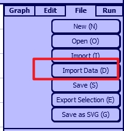

# Import CSV Manual

version 0.0.1

## Definition

* Import Data: The newly added feature of Machinations to use CSV files or Excel files to change the attribute values of different models.

* CSV: [Comma-separated values](https://en.wikipedia.org/wiki/Comma-separated_values) The file format Machinations use to change the attribute values of different models.

* Model: Generic term to describe components in Machinations. A model can be either an element or a connection.

* Element: Components of Machinations, including pool, gate, source, sink, etc.

* Connection: Lines used to connect elements, there're only two types of connections: resource connection and state connection.

* Identifier: Unique string to identify a model. When the model is an element, the identifier is the label of it. When the model is a connection, since the label of the connection has already been used, we use the caption of it instead.

* Caption: New attribute added for identifying connections.

* Attribute: Features of models. Let's take the pool element panel for example, you can change the color, thickness, label, activation mode of a pool in this element panel. All the features here are attributes.

<p align="center">
  
</p>

* Attribute value / Value: Value of the attribute. For the pool here, the string "black" is the value for attribute "Color", the number "2" is the value for attribute "Thickness".

## CSV File Structure

For a valid CSV file used in Machinations, the correct format should be like:

```
[Identifier], [Attribute], [Value]
[Identifier], [Attribute], [Value]
[Identifier], [Attribute], [Value]
...
```

For each CSV line, Import Data Function will find the model that has the same `Identifier`, and change the `Attribute` to `Value` for this model. For example, if one line of your CSV file is `pool1, color, red`, importing this line means find all the models that has the identifier `pool1`, change their `color` to `red`. To make it clear, if more than one model in Machinations have identifier `pool1`, all their colors are changed after importing this CSV line. Give different models different identifiers if you don't want this to happen.

## Import CSV Example and Result

Let's take a real CSV file for example. The content of it is:

```
pool1, Color, Red
pool1, Thickness, 3
pool1, Activation, onstart
pool1, Actions, 5
pool1, Pull   Mode, push all
pool1, Resources, Red
pool1, Number, 5
pool1, Capacity, 20
pool1, Display Cap., 100
source1, Color, Blue
source1, Thickness, 5
source1, Activation, on Start
source1, Pull Mode, pull all
source1, Resources, Blue
flow1, Color, Brown
flow1, thickness, 4
flow1, Label, 10
flow1, min. value, -99
flow1, max. value, 99
```

And let's add two plain element in machinations and identify them `pool1` and `source1` separately. Then we use a resource connection to connect them together and identify the connection `flow1` by changing the *caption* of it. Now the Machinations look like this:

<p align="center">
  
</p>

As you can see the label will be displayed on the screen while the caption will not. Then we use the **Import Data** to import this csv file. You need to click the file panel and click *Import Data (D)* or simply press *D* on your keyboard. On the select file dialog popped out, select the CSV file you want to import and click *open*.

<p align="center">
  
</p>

After the process is done, the Machinations will look like this:

<p align="center">
  
</p>

That's basically the magic of **Import Data**, you can use a CSV file to change the values of nearly all the attributes of elements that are identified.

## Basic Rules of Writing CSV Files

Rules for `Identifier`, `Attribute` and `Value`:

* All leading and trailing whitespace characters will be removed. e.g. CSV line `-pool1--,---color--,--red--` (use `-` to represent spaces) will be treated as `pool1,color,red`.

* No line break is allowed in all 3 parts.

* No comma is allowed in all 3 parts.

Rules for `Identifier`:

* `Identifier` is case sensitive. e.g. `pool1` and `Pool1` are different identifiers.

Rules for `Attribute`:

* `Attribute` is case insensitive. e.g. `color` and `Color` are the same attribute.

* Repeating spaces in `Attribute` will be deleted. e.g. `Pull-------Mode` (use `-` to represent spaces) will be treated as `Pull-Mode`.

* You can find nearly every `Attribute` from the element panel. Take the pool element panel in [this chapter](#definition) for example, there are `Attributes` like `Color`, `Thickness`, `Label`, `Activation`, `Actions`, `Pull Mode`, `Resources`, `Number`, `Capacity` and `Display Cap.` (Don't forget the dot) in it. Every `Attribute` listed here can be used as an `Attribute` in CSV file except `Label`, `Label` is an identifier and identifier can not be changed by CSV file.

* For connections, the identifier is `Caption`, so `Caption` can not be changed by CSV file.

Rules for `Value`:

* `Value` is case insensitive. e.g. `red` and `RED` are the same value.

* The `Value` in CSV file is nearly the same as the `Value` you fill in the blocks of element panel. Also take the pool element panel in [this chapter](#definition) for example, for every `Attribute` you can find its `Value` there except "Activation". One trick is that you can place your cursor on the type of "Activation" you want to use and Machinations will tell you the `Value` of it so you can use the same `Value` in CSV file. Just like the image showed that you can get the `Value` "Interactive" by following this trick.

<p align="center">
  
</p>

## Full Lists of Supported CSV Syntax

### Pool:

| Attribute | Value |
|-----------|-------|
| Color | black, white, red, darkred, orange, orangered, yellow, gold, green, lime, blue, lightblue, darkblue, purple, violet, teal, gray, darkgray, brown |
| Thickness | Integer |
| Activation | automatic, interactive, passive, onstart |
| Actions | Integer |
| Pull Mode | pull any, pull all, push any, push all |
| Resources | black, white, red, darkred, orange, orangered, yellow, gold, green, lime, blue, lightblue, darkblue, purple, violet, teal, gray, darkgray, brown |
| Number | Integer |
| Capacity | Integer |
| Display Cap. | Integer |

### Gate:

| Attribute | Value |
|-----------|-------|
| Color | black, white, red, darkred, orange, orangered, yellow, gold, green, lime, blue, lightblue, darkblue, purple, violet, teal, gray, darkgray, brown |
| Thickness | Integer |
| Activation | automatic, interactive, passive, onstart |
| Actions | Integer |
| Pull Mode | pull any, pull all, push any, push all |
| Type | deterministic, dice, skill, strategy, multiplayer |

### Resource Connection / State Connection:

| Attribute | Value |
|-----------|-------|
| Color | black, white, red, darkred, orange, orangered, yellow, gold, green, lime, blue, lightblue, darkblue, purple, violet, teal, gray, darkgray, brown |
| Thickness | Integer |
| Label | String |
| Min. Value | Float |
| Max. Value | Float |

### Source / Converter / Trader:

| Attribute | Value |
|-----------|-------|
| Color | black, white, red, darkred, orange, orangered, yellow, gold, green, lime, blue, lightblue, darkblue, purple, violet, teal, gray, darkgray, brown |
| Thickness | Integer |
| Activation | automatic, interactive, passive, onstart |
| Actions | Integer |
| Pull Mode | pull any, pull all, push any, push all |
| Resources | black, white, red, darkred, orange, orangered, yellow, gold, green, lime, blue, lightblue, darkblue, purple, violet, teal, gray, darkgray, brown |

### Sink / EndCondition:

| Attribute | Value |
|-----------|-------|
| Color | black, white, red, darkred, orange, orangered, yellow, gold, green, lime, blue, lightblue, darkblue, purple, violet, teal, gray, darkgray, brown |
| Thickness | Integer |
| Activation | automatic, interactive, passive, onstart |
| Actions | Integer |
| Pull Mode | pull any, pull all, push any, push all |

### Delay

| Attribute | Value |
|-----------|-------|
| Color | black, white, red, darkred, orange, orangered, yellow, gold, green, lime, blue, lightblue, darkblue, purple, violet, teal, gray, darkgray, brown |
| Thickness | Integer |
| Activation | automatic, interactive, passive, onstart |
| Actions | Integer |
| Queue | yes, no, 1, 0, true, false |

### ArtificialPlayer

| Attribute | Value |
|-----------|-------|
| Color | black, white, red, darkred, orange, orangered, yellow, gold, green, lime, blue, lightblue, darkblue, purple, violet, teal, gray, darkgray, brown |
| Thickness | Integer |
| Activation | automatic, interactive, passive, onstart |
| Actions/Turn | Integer |
| Script | String |

## Miscellaneous Stuff

* Register is currently not supported. It's kind of complex and needs more discussion.

* For `Script` in **ArtificialPlayer**, since no line break is allowed, you can use `;` to replace line breaks in your original script. e.g. You can write `if (Gem < 10) fire(Kill); if(Gem > 30) fire(Buy)` in `Value` and Machinations will split this `Value` into 2 lines when it set the `Script` of **ArtificialPlayer**.